# HR Sparse4D v3: Complete Step-by-Step Technical Guide 🚗🔍

## Table of Contents
1. [System Overview](#system-overview)
2. [Input Processing Pipeline](#input-processing-pipeline)
3. [Multi-View Feature Extraction](#multi-view-feature-extraction)
4. [Temporal Instance Bank](#temporal-instance-bank)
5. [4D Deformable Attention](#4d-deformable-attention)
6. [Temporal Instance Denoising](#temporal-instance-denoising)
7. [Decoupled Attention Mechanism](#decoupled-attention-mechanism)
8. [Quality Estimation Module](#quality-estimation-module)
9. [Depth Estimation Integration](#depth-estimation-integration)
10. [Transformer Decoder](#transformer-decoder)
11. [Prediction Heads](#prediction-heads)
12. [Post-Processing](#post-processing)
13. [Training & Loss Functions](#training--loss-functions)
14. [Hardware Optimization](#hardware-optimization)
15. [Production Deployment](#production-deployment)

---

## System Overview 🏗️

HR Sparse4D v3 is an end-to-end 4D object detection and tracking system that processes multi-view camera inputs to generate 3D detections with consistent tracking IDs across time.

### High-Level Architecture

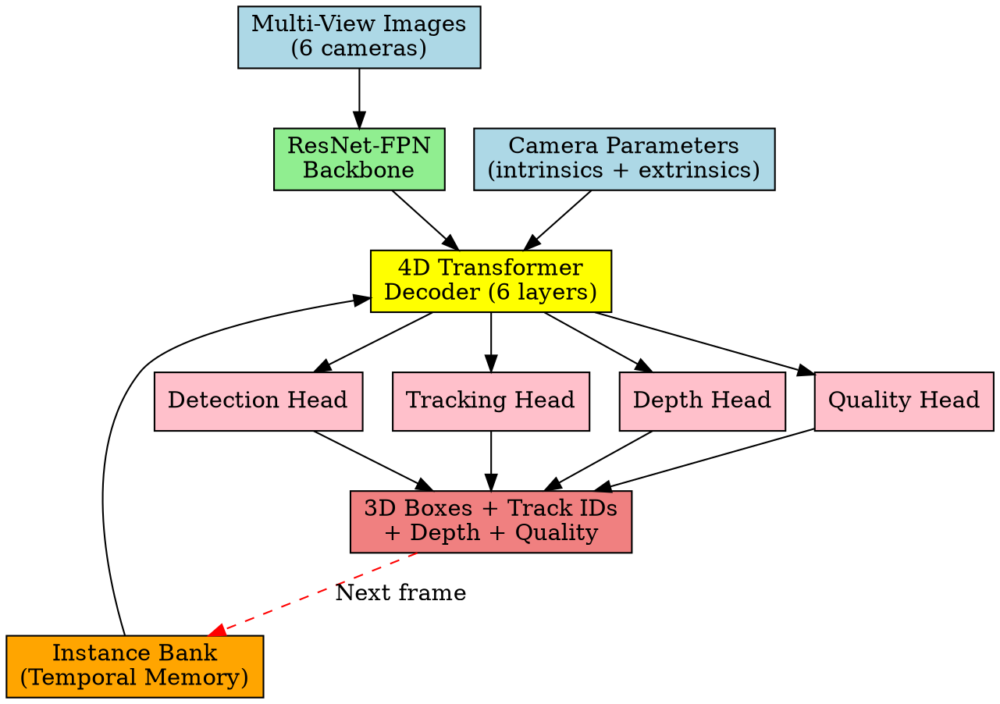

### Core Innovation: Sparse 4D Representation 🎯

Unlike dense BEV methods, Sparse4D uses:
- **Sparse queries**: 900 learnable object queries instead of dense grids
- **Temporal propagation**: O(1) complexity through instance bank
- **4D attention**: Direct sampling in 4D space (x,y,z,t)

---

## Input Processing Pipeline 📥

### 1. Multi-View Image Input

```
Input Format:
┌─────────────────────────────────────────┐
│ Batch Size: B                           │
│ Cameras: 6 (surround view)              │
│ Channels: 3 (RGB)                       │
│ Resolution: H × W                       │
│                                         │
│ Shape: [B, 6, 3, H, W]                  │
│                                         │
│ Standard resolutions:                   │
│ • Small: 256 × 704                      │
│ • Base: 512 × 1408                      │
│ • Large: 640 × 1600                     │
└─────────────────────────────────────────┘
```

### 2. Camera Configuration 📷

```
Camera Layout (Top View):
    CAM_FRONT
        🔍
        │
CAM_FL ─── 🚗 ─── CAM_FR
   🔍     (EGO)    🔍
        │
CAM_BL ─── │ ─── CAM_BR
   🔍   CAM_BACK   🔍
        🔍
```

### 3. Camera Parameters Structure

```python
camera_params = {
    'intrinsics': torch.tensor([B, 6, 3, 3]),  # Camera matrices
    'extrinsics': torch.tensor([B, 6, 4, 4]),  # Camera-to-vehicle transforms
    'timestamps': torch.tensor([B, 6]),        # Sync timestamps
}

# Intrinsic matrix K:
# [[fx,  0, cx],
#  [ 0, fy, cy],
#  [ 0,  0,  1]]

# Extrinsic matrix [R|t]:
# [[r11, r12, r13, tx],
#  [r21, r22, r23, ty], 
#  [r31, r32, r33, tz],
#  [  0,   0,   0,  1]]
```

---

## Multi-View Feature Extraction 🔧

### 1. ResNet-FPN Backbone Architecture

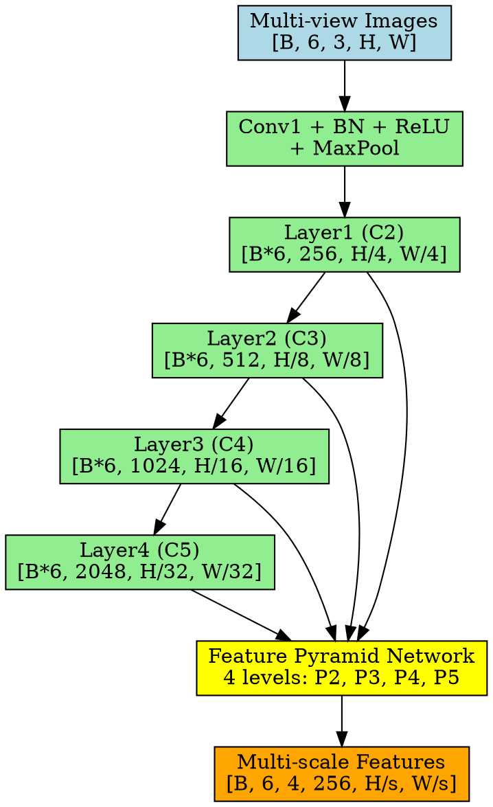

### 2. Feature Processing Flow

```
Per-Camera Processing:
╔══════════════════════════════════════════════════════════════╗
║ For each camera view (6 cameras):                           ║
║                                                              ║
║ Input: [B, 3, H, W] → ResNet Backbone → [B, 2048, H/32, W/32] ║
║                                    ↓                         ║
║              FPN Processing → {P2, P3, P4, P5}              ║
║                                    ↓                         ║
║         Output: [B, 256, H/4, W/4] per level                ║
╚══════════════════════════════════════════════════════════════╝
```

### 3. Multi-Scale Feature Pyramid

```
FPN Output Structure:
┌─────────────────────────────────────────┐
│ P2: [B, 6, 256, H/4,  W/4 ] - Fine     │ 🔍 High resolution
│ P3: [B, 6, 256, H/8,  W/8 ] - Medium   │ 🔍 Medium resolution  
│ P4: [B, 6, 256, H/16, W/16] - Coarse   │ 🔍 Low resolution
│ P5: [B, 6, 256, H/32, W/32] - Coarsest │ 🔍 Lowest resolution
└─────────────────────────────────────────┘

Usage:
• P2: Small objects (pedestrians, bikes)
• P3: Medium objects (cars)  
• P4: Large objects (trucks, buses)
• P5: Very large/distant objects
```

---

## Temporal Instance Bank 🏦

The Instance Bank is the core temporal memory system that maintains object representations across frames.

### 1. Instance Bank Architecture

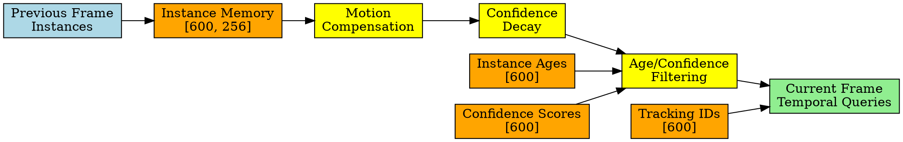

### 2. Instance Bank Parameters

```python
# Configuration
MAX_INSTANCES = 600        # Maximum temporal instances
DECAY_FACTOR = 0.6        # Confidence decay per frame  
MAX_HISTORY = 8           # Maximum frame lifetime
CONF_THRESHOLD = 0.25     # Minimum confidence to keep
EMBED_DIMS = 256          # Feature dimensions
```

### 3. Temporal Propagation Algorithm

```python
def propagate_instances(self, prev_instances, ego_motion, frame_idx):
    """
    Temporal instance propagation with motion compensation
    
    Args:
        prev_instances: [B, N, 256] - Previous frame features
        ego_motion: [B, 6] - Vehicle motion [dx, dy, dz, roll, pitch, yaw]  
        frame_idx: int - Current frame index
    
    Returns:
        temporal_instances: [B, 600, 256] - Propagated instances
    """
    
    # Step 1: Age all existing instances
    self.instance_ages[self.active_mask] += 1
    
    # Step 2: Apply confidence decay
    age_decay = torch.pow(self.decay_factor, self.instance_ages.float())
    self.instance_confidences *= age_decay
    
    # Step 3: Motion compensation
    compensated_instances = self._apply_ego_motion_compensation(
        prev_instances, ego_motion
    )
    
    # Step 4: Filter by age and confidence
    keep_mask = (
        (self.instance_confidences > self.CONF_THRESHOLD) & 
        (self.instance_ages < self.MAX_HISTORY)
    )
    
    # Step 5: Update instance bank
    self._update_instances(compensated_instances, keep_mask)
    
    # Step 6: Return temporal queries for current frame
    return self.get_temporal_queries()
```

### 4. Motion Compensation Mathematics

The ego motion compensation transforms instances from previous frame coordinate system to current frame:

```
Motion Compensation Formula:
P_current = R_ego × (P_previous + v_ego × Δt) + T_ego

Where:
• P_previous: 3D position in previous frame
• R_ego: Ego vehicle rotation matrix
• v_ego: Ego vehicle velocity
• T_ego: Ego vehicle translation
• Δt: Time difference between frames
```

### 5. Instance Bank State Diagram

```
Instance Lifecycle:
┌─────────────┐
│ New Object  │
│ Detected    │ 
└─────┬───────┘
      │
      ▼
┌─────────────┐    age++, conf *= decay
│ Active      │◄─────────────────────────┐
│ Instance    │                          │
└─────┬───────┘                          │
      │                                  │
      ▼                                  │
┌─────────────┐                          │
│ Check       │  conf > threshold &      │
│ Validity    │  age < max_history ──────┘
└─────┬───────┘
      │
      ▼ (invalid)
┌─────────────┐
│ Remove      │
│ Instance    │
└─────────────┘
```

---

## 4D Deformable Attention 🎯

This is the core innovation that enables sparse 4D sampling across space and time.

### 1. 4D Attention Architecture

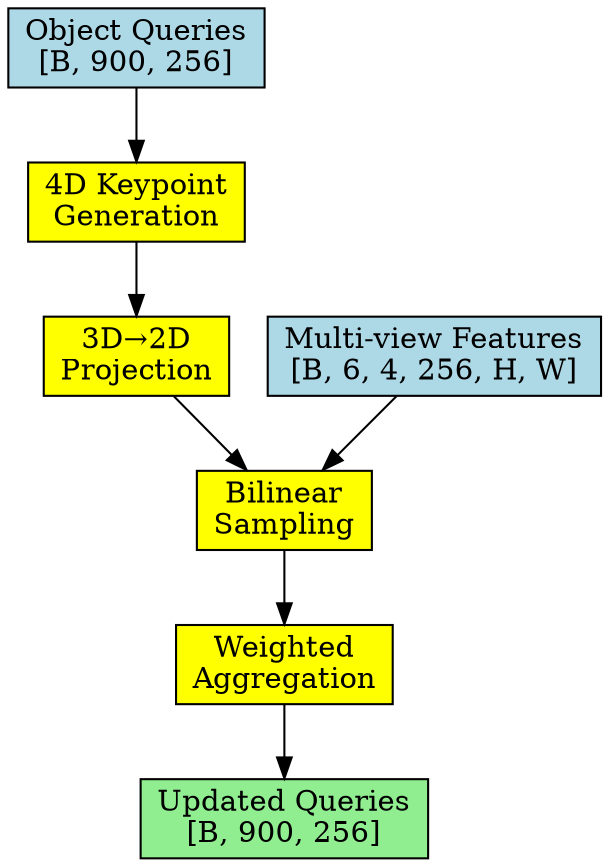

### 2. 4D Keypoint Sampling Strategy

HR Sparse4D v3 uses **13 sampling points** per query:
- **7 fixed keypoints**: Anchor-relative positions (HR standard)
- **6 learnable keypoints**: Network-predicted offsets

```python
# Fixed keypoint layout (HR specification)
fixed_positions = torch.tensor([
    [0.0, 0.0],    # Center anchor
    [-1.0, -1.0],  [-1.0, 0.0],  [-1.0, 1.0],  # Left column
    [1.0, -1.0],   [1.0, 0.0],   [1.0, 1.0]    # Right column
])

# Learnable offsets
learnable_offsets = offset_net(query_features)  # [B, N, 6*2]
learnable_offsets = torch.tanh(learnable_offsets) * 2.0  # HR scaling

# Combined keypoints
all_keypoints = torch.cat([fixed_positions, learnable_offsets], dim=2)
# Shape: [B, N, 13, 2]
```

### 3. 4D Sampling Visualization

```
4D Keypoint Sampling Pattern:
┌─────────────────────────────────────────┐
│ Object Query in 3D Space                │
│                                         │
│     • ← Fixed keypoints (7)             │ 
│   • ◦ •                                 │ 
│     •     ○ ← Learnable keypoints (6)   │
│   • ◦ •                                 │
│     •                                   │
│                                         │
│ Each keypoint projects to all cameras   │
│ and samples features at multiple scales │
└─────────────────────────────────────────┘

Projection Formula:
p_2d = K × [R|T] × [x, y, z, 1]ᵀ

Where:
• K: Camera intrinsic matrix
• [R|T]: Camera extrinsic matrix  
• [x,y,z]: 3D keypoint position
```

### 4. Multi-View Projection Mathematics

```python
def project_and_sample(self, queries, keypoints, multi_view_features, camera_params):
    """
    Project 3D keypoints to 2D and sample features
    
    Args:
        queries: [B, N, 256] - Object queries
        keypoints: [B, N, 13, 2] - 2D offsets from anchor  
        multi_view_features: List of [B, 256, H, W] for each camera
        camera_params: Camera intrinsic and extrinsic parameters
    
    Returns:
        sampled_features: [B, N, 13, 256] - Sampled features
    """
    B, N, K, _ = keypoints.shape
    sampled_features = torch.zeros(B, N, K, 256, device=queries.device)
    
    for cam_idx in range(6):  # For each camera
        # Extract 3D anchor positions from queries
        anchor_3d = self.extract_3d_position(queries)  # [B, N, 3]
        
        # Project to 2D camera coordinates
        intrinsic = camera_params['intrinsics'][:, cam_idx]  # [B, 3, 3]
        extrinsic = camera_params['extrinsics'][:, cam_idx]  # [B, 4, 4]
        
        # Transform to camera coordinates
        anchor_cam = torch.matmul(extrinsic[:, :3, :3], anchor_3d.transpose(-1, -2)) + \
                     extrinsic[:, :3, 3:4]  # [B, 3, N]
        
        # Project to image plane
        anchor_2d = torch.matmul(intrinsic, anchor_cam)  # [B, 3, N]
        anchor_2d = anchor_2d[:, :2] / anchor_2d[:, 2:3]  # Normalize by depth
        
        # Add keypoint offsets
        for k in range(K):
            sample_points = anchor_2d + keypoints[:, :, k].transpose(-1, -2)
            
            # Bilinear sampling from feature maps
            feature = self.bilinear_sample(
                multi_view_features[cam_idx], 
                sample_points
            )
            sampled_features[:, :, k] += feature / 6  # Average across cameras
    
    return sampled_features
```

### 5. Attention Weight Computation

```python
def compute_attention_weights(self, queries):
    """
    Compute attention weights for 13 sampling points
    
    Args:
        queries: [B, N, 256] - Object queries
    
    Returns:
        attention_weights: [B, N, 13] - Normalized attention weights
    """
    # Generate attention scores
    attn_logits = self.attention_net(queries)  # [B, N, 13]
    
    # Apply softmax normalization
    attention_weights = torch.softmax(attn_logits, dim=-1)
    
    return attention_weights
```

---

## Temporal Instance Denoising 🧠

Sparse4D v3 introduces temporal instance denoising as a key innovation, extending 2D single-frame denoising to 3D temporal scenarios.

### 1. Temporal Denoising Architecture

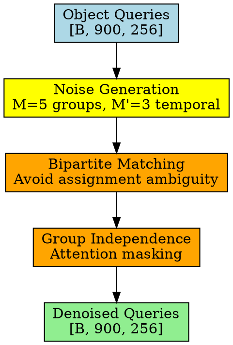

### 2. Noise Distribution Parameters

```python
# Temporal denoising configuration
NOISE_GROUPS = 5              # M=5 groups for denoising
TEMPORAL_GROUPS = 3           # M'=3 for temporal propagation
POSITIVE_NOISE_SCALE = 0.1    # Uniform noise around GT
NEGATIVE_NOISE_SCALE = 1.0    # Larger noise for negatives
```

### 3. Temporal Noise Generation

```python
def generate_temporal_noise(self, gt_boxes, num_groups=5, temporal_groups=3):
    """
    Generate temporal noise for denoising training
    
    Args:
        gt_boxes: [B, N, 10] - Ground truth boxes with velocity
        num_groups: int - Total denoising groups
        temporal_groups: int - Temporal propagation groups
    
    Returns:
        noisy_queries: [B, N*num_groups, 256] - Noisy query features
    """
    B, N, _ = gt_boxes.shape
    
    # Generate positive samples (close to GT)
    positive_noise = torch.randn(B, N, temporal_groups, 10) * 0.1
    positive_boxes = gt_boxes.unsqueeze(2) + positive_noise
    
    # Generate negative samples (far from GT)
    negative_noise = torch.randn(B, N, num_groups-temporal_groups, 10) * 1.0
    negative_boxes = gt_boxes.unsqueeze(2) + negative_noise
    
    # Combine all noisy samples
    all_noisy_boxes = torch.cat([positive_boxes, negative_boxes], dim=2)
    
    # Convert to query features
    noisy_queries = self.box_to_query_embedding(all_noisy_boxes)
    
    return noisy_queries.view(B, N*num_groups, 256)
```

### 4. Bipartite Matching Strategy

```python
def bipartite_matching(self, predictions, targets, noise_groups):
    """
    Bipartite matching to avoid assignment ambiguity
    
    Args:
        predictions: [B, N*M, num_classes] - Predicted classes
        targets: [B, N] - Ground truth targets
        noise_groups: int - Number of noise groups
    
    Returns:
        matched_indices: Optimal assignment indices
    """
    # Compute cost matrix
    cost_class = -predictions.softmax(-1)[..., targets]  # Classification cost
    cost_bbox = torch.cdist(predictions[..., :3], targets[..., :3])  # L1 cost
    
    # Combined cost
    cost_matrix = cost_class + cost_bbox
    
    # Hungarian algorithm for optimal assignment
    from scipy.optimize import linear_sum_assignment
    matched_indices = []
    
    for b in range(len(cost_matrix)):
        indices = linear_sum_assignment(cost_matrix[b].cpu())
        matched_indices.append(indices)
    
    return matched_indices
```

---

## Decoupled Attention Mechanism 🔄

V3 introduces decoupled attention that replaces addition with concatenation in attention calculations.

### 1. Decoupled vs Traditional Attention

```python
# Traditional attention (v1/v2)
def traditional_attention(query, key, value):
    attention_weights = torch.softmax(
        torch.matmul(query + pos_embed, (key + pos_embed).transpose(-2, -1)), 
        dim=-1
    )
    return torch.matmul(attention_weights, value + pos_embed)

# Decoupled attention (v3)
def decoupled_attention(query, key, value, pos_embed):
    # Concatenation instead of addition
    query_with_pos = torch.cat([query, pos_embed], dim=-1)  # 256 -> 512
    key_with_pos = torch.cat([key, pos_embed], dim=-1)      # 256 -> 512
    
    # Multi-head external processing
    attention_weights = torch.softmax(
        torch.matmul(query_with_pos, key_with_pos.transpose(-2, -1)), 
        dim=-1
    )
    
    # Reduced feature interference
    attended_features = torch.matmul(attention_weights, value)
    
    # Project back to original dimensions
    return self.output_projection(attended_features)  # 256
```

### 2. Decoupled Processing Pipeline

```
Dimension Processing Pipeline:
┌─────────────────────────────────────────┐
│ Input: Query [B, N, 256]                │
│        Key   [B, N, 256]                │
│        Value [B, N, 256]                │
│        Pos   [B, N, 256]                │
│                                         │
│ Step 1: Concatenation                   │
│   Query_ext = cat(Query, Pos) → [512]   │
│   Key_ext   = cat(Key, Pos)   → [512]   │
│                                         │
│ Step 2: Attention Computation           │
│   Attn = softmax(Q_ext @ K_ext^T)       │
│                                         │
│ Step 3: Value Processing                │
│   Output = Attn @ Value → [B, N, 256]   │
│                                         │
│ Benefits: Reduced interference,         │
│          Improved attention accuracy    │
└─────────────────────────────────────────┘
```

### 3. Implementation Details

```python
class DecoupledMultiHeadAttention(nn.Module):
    def __init__(self, embed_dims=256, num_heads=8):
        super().__init__()
        self.embed_dims = embed_dims
        self.num_heads = num_heads
        self.head_dims = embed_dims // num_heads
        
        # Extended dimensions for concatenation
        self.extended_dims = embed_dims * 2  # 512
        
        # Projection layers
        self.q_proj = nn.Linear(self.extended_dims, embed_dims)
        self.k_proj = nn.Linear(self.extended_dims, embed_dims)
        self.v_proj = nn.Linear(embed_dims, embed_dims)
        self.out_proj = nn.Linear(embed_dims, embed_dims)
        
    def forward(self, query, key, value, pos_embed):
        B, N, C = query.shape
        
        # Concatenate with positional embeddings
        query_ext = torch.cat([query, pos_embed], dim=-1)  # [B, N, 512]
        key_ext = torch.cat([key, pos_embed], dim=-1)      # [B, N, 512]
        
        # Project to attention space
        Q = self.q_proj(query_ext).view(B, N, self.num_heads, self.head_dims)
        K = self.k_proj(key_ext).view(B, N, self.num_heads, self.head_dims)
        V = self.v_proj(value).view(B, N, self.num_heads, self.head_dims)
        
        # Transpose for attention computation
        Q = Q.transpose(1, 2)  # [B, num_heads, N, head_dims]
        K = K.transpose(1, 2)
        V = V.transpose(1, 2)
        
        # Scaled dot-product attention
        scale = self.head_dims ** -0.5
        attn = torch.softmax(torch.matmul(Q, K.transpose(-2, -1)) * scale, dim=-1)
        
        # Apply attention to values
        out = torch.matmul(attn, V)  # [B, num_heads, N, head_dims]
        out = out.transpose(1, 2).reshape(B, N, C)  # [B, N, 256]
        
        return self.out_proj(out)
```

---

## Quality Estimation Module 📊

V3 introduces quality estimation with centerness and yawness metrics for improved detection confidence.

### 1. Quality Metrics Architecture

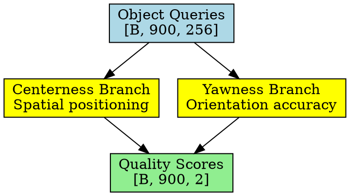

### 2. Quality Metrics Mathematics

```python
# Centerness metric
def compute_centerness(pred_boxes, gt_boxes):
    """
    Centerness = exp(-||[x,y,z]_pred - [x,y,z]_gt||_2)
    """
    position_error = torch.norm(
        pred_boxes[:, :3] - gt_boxes[:, :3], dim=-1
    )
    centerness = torch.exp(-position_error)
    return centerness

# Yawness metric  
def compute_yawness(pred_boxes, gt_boxes):
    """
    Yawness = [sin yaw, cos yaw]_pred · [sin yaw, cos yaw]_gt
    """
    pred_yaw = pred_boxes[:, 6]  # Yaw angle
    gt_yaw = gt_boxes[:, 6]
    
    pred_yaw_vec = torch.stack([torch.sin(pred_yaw), torch.cos(pred_yaw)], dim=-1)
    gt_yaw_vec = torch.stack([torch.sin(gt_yaw), torch.cos(gt_yaw)], dim=-1)
    
    yawness = torch.sum(pred_yaw_vec * gt_yaw_vec, dim=-1)
    return yawness
```

### 3. Quality Estimation Implementation

```python
class QualityEstimationHead(nn.Module):
    def __init__(self, embed_dims=256):
        super().__init__()
        
        # Centerness estimation network
        self.centerness_net = nn.Sequential(
            nn.Linear(embed_dims, embed_dims // 2),
            nn.ReLU(inplace=True),
            nn.Linear(embed_dims // 2, 1),
            nn.Sigmoid()
        )
        
        # Yawness estimation network
        self.yawness_net = nn.Sequential(
            nn.Linear(embed_dims, embed_dims // 2),
            nn.ReLU(inplace=True),
            nn.Linear(embed_dims // 2, 1),
            nn.Sigmoid()
        )
        
    def forward(self, query_features):
        """
        Args:
            query_features: [B, N, 256] - Object query features
        
        Returns:
            quality_scores: [B, N, 2] - [centerness, yawness]
        """
        centerness = self.centerness_net(query_features)  # [B, N, 1]
        yawness = self.yawness_net(query_features)        # [B, N, 1]
        
        quality_scores = torch.cat([centerness, yawness], dim=-1)
        return quality_scores
```

### 4. Quality Loss Functions

```python
def compute_quality_loss(pred_quality, gt_boxes, pred_boxes):
    """
    Compute quality estimation loss
    
    Args:
        pred_quality: [B, N, 2] - Predicted quality scores
        gt_boxes: [B, N, 10] - Ground truth boxes
        pred_boxes: [B, N, 10] - Predicted boxes
    
    Returns:
        quality_loss: Scalar loss
    """
    # Compute ground truth quality targets
    gt_centerness = compute_centerness(pred_boxes, gt_boxes)
    gt_yawness = compute_yawness(pred_boxes, gt_boxes)
    gt_quality = torch.stack([gt_centerness, gt_yawness], dim=-1)
    
    # Cross-entropy loss for yawness (discrete)
    yawness_loss = F.binary_cross_entropy(
        pred_quality[:, :, 1], gt_quality[:, :, 1]
    )
    
    # Focal loss for centerness (continuous)
    centerness_loss = focal_loss(
        pred_quality[:, :, 0], gt_quality[:, :, 0], 
        alpha=0.25, gamma=2.0
    )
    
    return centerness_loss + yawness_loss
```

---

## Depth Estimation Integration 📏

HR Sparse4D v3 integrates sophisticated depth estimation at multiple levels.

### 1. Depth Branch Architecture

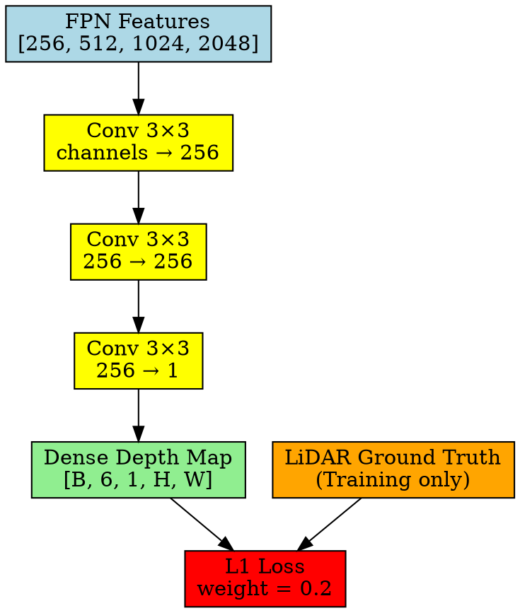

### 2. Dense Depth Supervision Configuration

```python
# Depth branch configuration (from HR documentation)
depth_branch = {
    'type': 'dense_depth',
    'embed_dims': 256,
    'num_depth_layers': 3,
    'loss_weight': 0.2,
    'supervision_format': 'lidar_points',
    'depth_range': [1.0, 60.0],  # meters
    'training_only': True  # Disabled during inference
}
```

### 3. Instance-Level Depth Reweighting

This addresses ill-posed 3D-to-2D projection challenges:

```python
def instance_depth_reweight(self, instance_features, depth_predictions):
    """
    Reweight instance features based on depth confidence
    
    Args:
        instance_features: [B, N, 256] - Instance features
        depth_predictions: [B, N, 1] - Predicted depths
    
    Returns:
        reweighted_features: [B, N, 256] - Depth-aware features
    """
    # Compute depth confidence based on prediction uncertainty
    depth_confidence = self.depth_confidence_net(depth_predictions)  # [B, N, 1]
    
    # Apply sigmoid to ensure [0,1] range
    depth_confidence = torch.sigmoid(depth_confidence)
    
    # Reweight features
    reweighted_features = instance_features * depth_confidence
    
    return reweighted_features, depth_confidence
```

### 4. Depth Integration Points

```
Depth Usage Throughout Pipeline:
┌─────────────────────────────────────────┐
│ 1. 3D Anchor Initialization            │ ← Depth priors
│    ↓                                    │
│ 2. 4D Keypoint Sampling                │ ← Depth-guided projection
│    ↓                                    │  
│ 3. Feature Aggregation                 │ ← Depth confidence weighting
│    ↓                                    │
│ 4. Temporal Propagation                │ ← Depth-aware motion
│    ↓                                    │
│ 5. Final Predictions                   │ ← Depth as auxiliary output
└─────────────────────────────────────────┘
```

### 5. Depth Loss Function

```python
def compute_depth_loss(self, pred_depth, gt_depth, valid_mask):
    """
    L1 loss for depth supervision
    
    Args:
        pred_depth: [B, 6, H, W] - Predicted depth maps
        gt_depth: [B, 6, H, W] - Ground truth from LiDAR
        valid_mask: [B, 6, H, W] - Valid depth regions
    
    Returns:
        depth_loss: Scalar tensor
    """
    # Apply valid mask
    pred_valid = pred_depth[valid_mask]
    gt_valid = gt_depth[valid_mask]
    
    # L1 loss
    l1_loss = torch.abs(pred_valid - gt_valid)
    
    # Average over valid pixels
    depth_loss = l1_loss.mean()
    
    return depth_loss * 0.2  # Loss weight from config
```

---

## Transformer Decoder 🧠

The 6-layer transformer decoder refines object queries through self and cross-attention.

### 1. Decoder Architecture

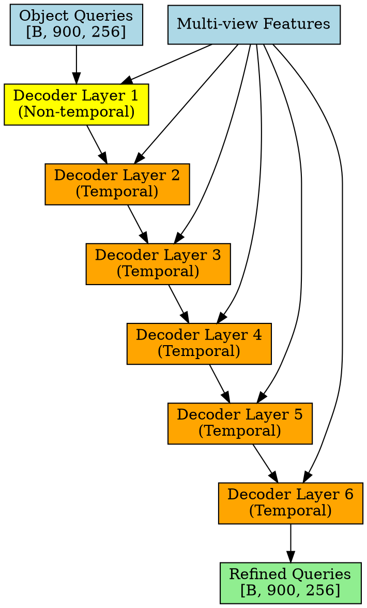

### 2. Single Decoder Layer Structure

```python
class Sparse4DDecoderLayer(nn.Module):
    """Single layer of Sparse4D transformer decoder"""
    
    def __init__(self, embed_dims=256, num_heads=8, is_temporal=True):
        super().__init__()
        self.embed_dims = embed_dims
        self.num_heads = num_heads
        self.is_temporal = is_temporal
        
        # Self-attention for query interactions
        self.self_attention = nn.MultiheadAttention(
            embed_dims, num_heads, batch_first=True
        )
        
        # Cross-attention through deformable attention
        if is_temporal:
            self.cross_attention = TemporalDeformableAttention(
                embed_dims, num_sampling_points=13
            )
        else:
            self.cross_attention = DeformableAttention(
                embed_dims, num_sampling_points=13
            )
        
        # Feed-forward network
        self.ffn = nn.Sequential(
            nn.Linear(embed_dims, embed_dims * 4),
            nn.ReLU(),
            nn.Dropout(0.1),
            nn.Linear(embed_dims * 4, embed_dims),
            nn.Dropout(0.1)
        )
        
        # Layer normalizations
        self.norm1 = nn.LayerNorm(embed_dims)
        self.norm2 = nn.LayerNorm(embed_dims)
        self.norm3 = nn.LayerNorm(embed_dims)
    
    def forward(self, queries, multi_view_features, camera_params):
        # Self-attention: query-to-query interactions
        attn_output, _ = self.self_attention(queries, queries, queries)
        queries = self.norm1(queries + attn_output)
        
        # Cross-attention: query-to-feature interactions
        cross_output = self.cross_attention(
            queries, multi_view_features, camera_params
        )
        queries = self.norm2(queries + cross_output)
        
        # Feed-forward network
        ffn_output = self.ffn(queries)
        queries = self.norm3(queries + ffn_output)
        
        return queries
```

### 3. Query Initialization Strategy

```python
def initialize_queries(self, batch_size, device):
    """
    Initialize 900 object queries: 600 temporal + 300 single-frame
    
    Returns:
        queries: [B, 900, 256] - Initialized object queries
    """
    # Temporal queries from instance bank
    temporal_queries = self.instance_bank.get_temporal_queries(batch_size)  # [B, 600, 256]
    
    # Single-frame detection queries (learnable embeddings)
    single_frame_queries = self.single_frame_embeddings.unsqueeze(0).expand(
        batch_size, -1, -1
    )  # [B, 300, 256]
    
    # Combine queries
    all_queries = torch.cat([temporal_queries, single_frame_queries], dim=1)
    
    # Add positional encoding
    pos_encoding = self.query_pos_encoding.unsqueeze(0).expand(batch_size, -1, -1)
    all_queries = all_queries + pos_encoding
    
    return all_queries
```

### 4. Temporal vs Non-Temporal Processing

```
Layer Configuration:
┌─────────────────────────────────────────┐
│ Layer 1: Non-Temporal                   │ → Basic feature extraction
│ • No temporal propagation              │
│ • Focus on current frame features      │
│                                         │
│ Layers 2-6: Temporal                   │ → Advanced temporal reasoning
│ • Access to temporal instance bank     │
│ • Motion-aware feature aggregation     │
│ • Cross-frame consistency              │
└─────────────────────────────────────────┘
```

---

## Prediction Heads 🎯

HR Sparse4D v3 uses 5 specialized prediction heads for different tasks.

### 1. Prediction Heads Architecture

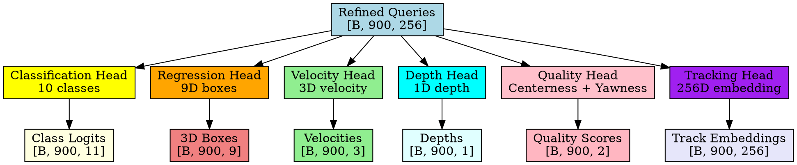

### 2. Classification Head (Focal Loss)

```python
class ClassificationHead(nn.Module):
    def __init__(self, embed_dims=256, num_classes=10):
        super().__init__()
        self.num_classes = num_classes
        
        self.cls_layers = nn.Sequential(
            nn.Linear(embed_dims, embed_dims),
            nn.ReLU(),
            nn.Linear(embed_dims, num_classes + 1)  # +1 for background
        )
    
    def forward(self, queries):
        """
        Args:
            queries: [B, 900, 256]
        Returns:
            cls_logits: [B, 900, 11] - Class probabilities
        """
        return self.cls_layers(queries)

# Class mapping for nuScenes:
CLASSES = [
    'car', 'truck', 'construction_vehicle', 'bus', 'trailer',
    'barrier', 'motorcycle', 'bicycle', 'pedestrian', 'traffic_cone'
]
```

### 3. Regression Head (3D Bounding Boxes)

```python
class RegressionHead(nn.Module):
    def __init__(self, embed_dims=256):
        super().__init__()
        
        self.reg_layers = nn.Sequential(
            nn.Linear(embed_dims, embed_dims),
            nn.ReLU(),
            nn.Linear(embed_dims, 9)  # [x, y, z, w, l, h, cos(θ), sin(θ), v]
        )
    
    def forward(self, queries):
        """
        Args:
            queries: [B, 900, 256]
        Returns:
            bbox_preds: [B, 900, 9] - 3D bounding box parameters
        """
        return self.reg_layers(queries)

# 3D Box format:
# [x, y, z]: Center coordinates in ego vehicle frame
# [w, l, h]: Width, length, height
# [cos(θ), sin(θ)]: Yaw angle encoding
# [v]: Velocity magnitude (optional)
```

### 4. Quality Estimation Head (New in v3)

This is a key innovation in Sparse4D v3 for improving prediction reliability:

```python
class QualityEstimationHead(nn.Module):
    def __init__(self, embed_dims=256):
        super().__init__()
        
        # Centerness estimation
        self.centerness_net = nn.Sequential(
            nn.Linear(embed_dims, embed_dims // 2),
            nn.ReLU(),
            nn.Linear(embed_dims // 2, 1),
            nn.Sigmoid()
        )
        
        # Yawness estimation
        self.yawness_net = nn.Sequential(
            nn.Linear(embed_dims, embed_dims // 2),
            nn.ReLU(),
            nn.Linear(embed_dims // 2, 1),
            nn.Sigmoid()
        )
    
    def forward(self, queries):
        """
        Args:
            queries: [B, 900, 256]
        Returns:
            quality_scores: [B, 900, 2] - [centerness, yawness]
        """
        centerness = self.centerness_net(queries)
        yawness = self.yawness_net(queries)
        
        return torch.cat([centerness, yawness], dim=-1)
```

### 5. Quality Metrics Mathematics

```python
def compute_quality_targets(self, pred_boxes, gt_boxes):
    """
    Compute ground truth quality scores
    
    Args:
        pred_boxes: [N, 9] - Predicted 3D boxes
        gt_boxes: [N, 9] - Ground truth 3D boxes
    
    Returns:
        centerness_targets: [N] - Centerness quality scores
        yawness_targets: [N] - Yaw quality scores
    """
    # Centerness: Exponential decay based on position error
    position_error = torch.norm(
        pred_boxes[:, :3] - gt_boxes[:, :3], dim=1
    )  # L2 distance
    centerness_targets = torch.exp(-position_error)
    
    # Yawness: Cosine similarity between yaw vectors
    pred_yaw = torch.atan2(pred_boxes[:, 7], pred_boxes[:, 6])  # sin, cos → angle
    gt_yaw = torch.atan2(gt_boxes[:, 7], gt_boxes[:, 6])
    
    yaw_similarity = torch.cos(pred_yaw - gt_yaw)
    yawness_targets = (yaw_similarity + 1) / 2  # Normalize to [0, 1]
    
    return centerness_targets, yawness_targets
```

### 6. Tracking Head (Instance Embeddings)

```python
class TrackingHead(nn.Module):
    def __init__(self, embed_dims=256, track_embed_dims=256):
        super().__init__()
        
        self.track_embedding = nn.Sequential(
            nn.Linear(embed_dims, embed_dims),
            nn.ReLU(),
            nn.Linear(embed_dims, track_embed_dims),
            nn.LayerNorm(track_embed_dims)
        )
    
    def forward(self, queries):
        """
        Args:
            queries: [B, 900, 256]
        Returns:
            track_embeddings: [B, 900, 256] - Instance embeddings for tracking
        """
        return self.track_embedding(queries)
```

---

## Post-Processing 🔧

Post-processing converts raw predictions into final detections and tracks.

### 1. Post-Processing Pipeline

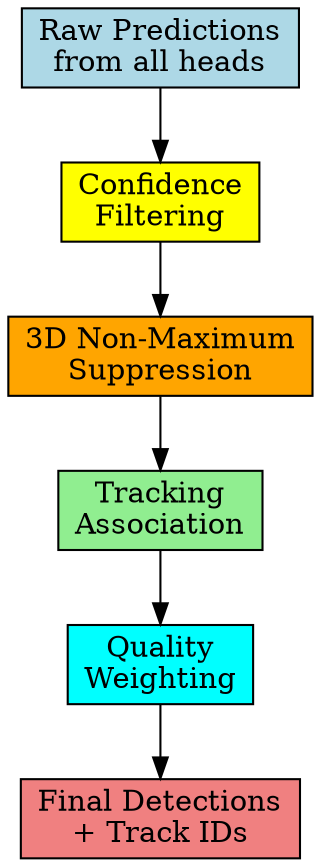

### 2. Confidence Filtering

```python
def confidence_filtering(self, cls_logits, bbox_preds, quality_scores, threshold=0.3):
    """
    Filter predictions by confidence threshold
    
    Args:
        cls_logits: [B, 900, 11] - Classification scores
        bbox_preds: [B, 900, 9] - 3D box predictions  
        quality_scores: [B, 900, 2] - Quality scores
        threshold: float - Confidence threshold
    
    Returns:
        Filtered predictions above threshold
    """
    # Get class probabilities (excluding background)
    cls_probs = torch.softmax(cls_logits, dim=-1)[:, :, :-1]  # [B, 900, 10]
    max_probs, pred_classes = torch.max(cls_probs, dim=-1)  # [B, 900]
    
    # Apply quality weighting
    centerness = quality_scores[:, :, 0]  # [B, 900]
    yawness = quality_scores[:, :, 1]     # [B, 900]
    quality_weight = torch.sqrt(centerness * yawness)
    
    # Final confidence
    final_confidence = max_probs * quality_weight
    
    # Filter by threshold
    valid_mask = final_confidence > threshold
    
    return {
        'valid_mask': valid_mask,
        'confidence': final_confidence[valid_mask],
        'classes': pred_classes[valid_mask],
        'boxes': bbox_preds[valid_mask],
        'quality': quality_scores[valid_mask]
    }
```

### 3. 3D Non-Maximum Suppression

```python
def nms_3d(self, boxes, scores, iou_threshold=0.5):
    """
    3D Non-Maximum Suppression
    
    Args:
        boxes: [N, 9] - 3D bounding boxes
        scores: [N] - Confidence scores
        iou_threshold: float - IoU threshold for suppression
    
    Returns:
        keep_indices: Indices of boxes to keep
    """
    if len(boxes) == 0:
        return torch.tensor([], dtype=torch.long)
    
    # Sort by confidence scores
    sorted_indices = torch.argsort(scores, descending=True)
    
    keep = []
    while len(sorted_indices) > 0:
        # Keep highest confidence box
        current = sorted_indices[0]
        keep.append(current)
        
        if len(sorted_indices) == 1:
            break
        
        # Compute IoU with remaining boxes
        current_box = boxes[current:current+1]  # [1, 9]
        remaining_boxes = boxes[sorted_indices[1:]]  # [N-1, 9]
        
        ious = self.compute_3d_iou(current_box, remaining_boxes)  # [N-1]
        
        # Keep boxes with IoU below threshold
        keep_mask = ious < iou_threshold
        sorted_indices = sorted_indices[1:][keep_mask]
    
    return torch.tensor(keep, dtype=torch.long)
```

### 4. Tracking Association

```python
def tracking_association(self, current_dets, prev_tracks, track_embeddings, threshold=0.2):
    """
    Associate current detections with previous tracks
    
    Args:
        current_dets: Current frame detections
        prev_tracks: Previous frame tracks  
        track_embeddings: [N, 256] - Instance embeddings
        threshold: float - Association threshold
    
    Returns:
        track_ids: Assigned track IDs for current detections
    """
    if len(prev_tracks) == 0:
        # Initialize new tracks
        return torch.arange(len(current_dets))
    
    # Compute embedding similarities
    current_embeds = track_embeddings  # [N_curr, 256]
    prev_embeds = torch.stack([t['embedding'] for t in prev_tracks])  # [N_prev, 256]
    
    # Cosine similarity
    similarities = torch.mm(
        F.normalize(current_embeds, dim=1),
        F.normalize(prev_embeds, dim=1).transpose(0, 1)
    )  # [N_curr, N_prev]
    
    # Hungarian algorithm for optimal assignment
    from scipy.optimize import linear_sum_assignment
    cost_matrix = 1 - similarities.cpu().numpy()  # Convert to cost
    
    curr_indices, prev_indices = linear_sum_assignment(cost_matrix)
    
    # Assign track IDs
    track_ids = torch.full((len(current_dets),), -1, dtype=torch.long)
    
    for curr_idx, prev_idx in zip(curr_indices, prev_indices):
        if similarities[curr_idx, prev_idx] > threshold:
            track_ids[curr_idx] = prev_tracks[prev_idx]['track_id']
    
    # Assign new IDs to unmatched detections
    next_id = max([t['track_id'] for t in prev_tracks]) + 1 if prev_tracks else 0
    for i in range(len(track_ids)):
        if track_ids[i] == -1:
            track_ids[i] = next_id
            next_id += 1
    
    return track_ids
```

### 5. Final Output Format

```python
# Final detection format
detection = {
    'boxes_3d': torch.tensor([x, y, z, w, l, h, yaw]),  # 3D bounding box
    'scores': torch.tensor([confidence]),                # Detection confidence  
    'labels': torch.tensor([class_id]),                 # Object class
    'track_ids': torch.tensor([track_id]),              # Tracking ID
    'velocities': torch.tensor([vx, vy, vz]),           # 3D velocity
    'depths': torch.tensor([depth]),                     # Estimated depth
    'quality': {
        'centerness': torch.tensor([centerness]),        # Position quality
        'yawness': torch.tensor([yawness])               # Orientation quality
    }
}
```

---

## Training & Loss Functions 📚

HR Sparse4D v3 uses a multi-task loss combining detection, tracking, depth, and quality objectives.

### 1. Loss Function Architecture

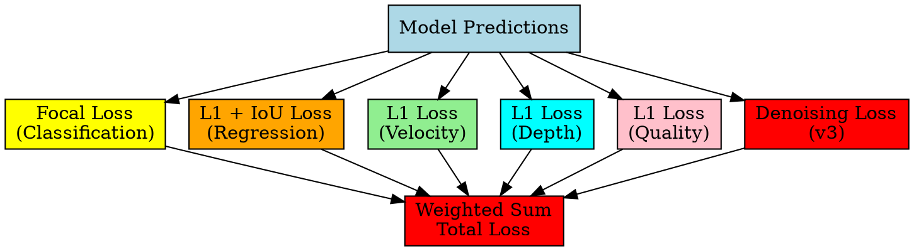

### 2. Complete Loss Function

```python
def compute_total_loss(self, predictions, targets):
    """
    Compute total training loss
    
    Args:
        predictions: Dict of model predictions
        targets: Dict of ground truth targets
    
    Returns:
        total_loss: Scalar loss tensor
        loss_dict: Dictionary of individual losses
    """
    losses = {}
    
    # 1. Classification Loss (Focal Loss)
    losses['cls_loss'] = self.focal_loss(
        predictions['cls_logits'], 
        targets['labels']
    ) * 2.0  # Weight: 2.0
    
    # 2. Regression Loss (L1 + IoU)
    losses['reg_loss'] = self.regression_loss(
        predictions['bbox_preds'],
        targets['boxes_3d']
    ) * 5.0  # Weight: 5.0
    
    # 3. Velocity Loss
    losses['vel_loss'] = F.l1_loss(
        predictions['velocities'],
        targets['velocities']
    ) * 1.0  # Weight: 1.0
    
    # 4. Depth Loss (training only)
    if self.training and 'depth_maps' in targets:
        losses['depth_loss'] = F.l1_loss(
            predictions['depth_maps'],
            targets['depth_maps']
        ) * 0.2  # Weight: 0.2
    
    # 5. Quality Loss (new in v3)
    losses['quality_loss'] = F.l1_loss(
        predictions['quality_scores'],
        targets['quality_targets']
    ) * 1.0  # Weight: 1.0
    
    # 6. Temporal Denoising Loss (new in v3)
    losses['denoise_loss'] = self.compute_denoising_loss(
        predictions['denoised_predictions'],
        targets['denoising_targets']
    ) * 1.0  # Weight: 1.0
    
    # Total loss
    total_loss = sum(losses.values())
    
    return total_loss, losses
```

### 3. Training Configuration (V3 Specific)

```python
# V3 Training hyperparameters
training_config = {
    'optimizer': 'AdamW',
    'learning_rate': {
        'backbone': 2e-5,      # Lower LR for backbone
        'other': 2e-4          # Higher LR for other parameters
    },
    'weight_decay': 0.01,
    'batch_size': 6,           # Per GPU (1×8 BS6 total)
    'epochs': 100,             # No separate tracking fine-tuning
    'warmup_epochs': 10,
    'lr_schedule': 'cosine_annealing',
    'hardware_requirement': '8 RTX 3090 GPUs (24GB each)',
    
    'data_augmentation': {
        'temporal_sampling': '2 FPS from 20s clips',
        'multi_view_setup': '6 camera viewpoints',
        'ego_motion_compensation': True,
        'velocity_integration': True
    },
    
    'denoising_config': {
        'noise_groups': 5,         # M=5 groups
        'temporal_groups': 3,      # M'=3 for temporal
        'positive_noise_scale': 0.1,
        'negative_noise_scale': 1.0,
        'bipartite_matching': True
    }
}
```

### 4. V3 Performance Metrics

```python
# V3 Performance improvements over V2
performance_metrics = {
    'detection_improvements': {
        'mAP': '+3.0%',
        'NDS': '+2.2%',
        'mATE': '0.553 (vs 0.598 in v2)'
    },
    
    'tracking_improvements': {
        'AMOTA': '+7.6%',
        'ID_switches': '632 (very low)',
        'AMOTP': '0.553m'
    },
    
    'inference_performance': {
        'ResNet50': '19.8 FPS',
        'EVA02-Large': '12.4 FPS',
        'Best_configuration': {
            'NDS': '71.9%',
            'AMOTA': '67.7%',
            'model': 'EVA02-Large + future frames'
        }
    },
    
    'ablation_contributions': {
        'single_frame_denoising': '+0.8% mAP, +0.9% NDS',
        'temporal_denoising': '+0.4% mAP, +0.6% NDS',
        'decoupled_attention': '+1.1% mAP, +1.9% mAVE',
        'quality_estimation': '+0.8% mAP, significant mATE improvement'
    }
}
```

---

## Hardware Optimization 🔧

HR Sparse4D v3 is optimized for Horizon Robotics' Journey 5 platform with 128 TOPS Bayesian BPU architecture.

### 1. Journey 5 Platform Architecture

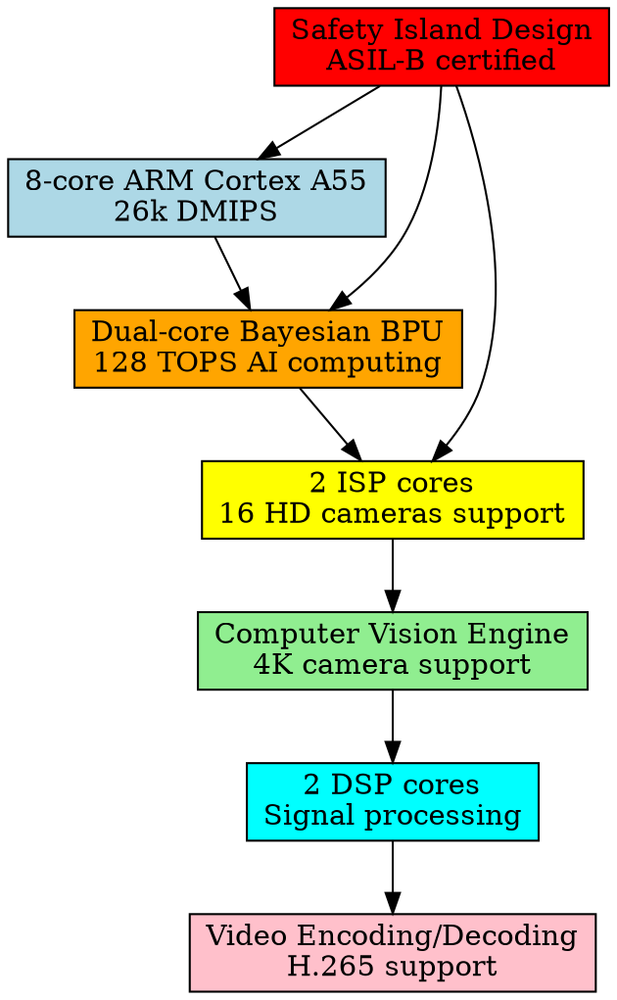

### 2. 128 TOPS Bayesian BPU Specifications

```python
# Bayesian BPU Configuration
bayesian_bpu = {
    'architecture': 'Dual-core Bayesian BPU',
    'computing_power': '128 TOPS',
    'precision_support': ['INT8', 'INT4', 'FP16', 'FP32'],
    'memory_bandwidth': 'High-speed data bridge',
    'optimization_targets': [
        'Deep learning acceleration',
        'Automotive AI workloads',
        'Real-time inference',
        'Energy efficiency'
    ],
    
    'specialized_features': {
        'probabilistic_computing': 'Uncertainty handling',
        'transformer_optimization': 'Multi-head attention acceleration',
        'sparse_processing': 'Optimized for Sparse4D',
        'temporal_fusion': 'O(1) complexity operations'
    },
    
    'deployment_capabilities': {
        'camera_inputs': '16 HD cameras (4K support)',
        'sensor_fusion': 'Multi-modal processing',
        'real_time_performance': '19.8 FPS (ResNet50)',
        'power_consumption': '8W total chip'
    }
}
```

### 3. Custom CUDA Operations

```python
# Sparse4D Custom CUDA Kernels
cuda_optimizations = {
    'deformable_4d_aggregation': {
        'description': 'Single CUDA operator for 4D sampling',
        'performance_gain': '42% faster inference',
        'memory_reduction': '51% GPU memory usage',
        'implementation': 'Hierarchical feature fusion'
    },
    
    'temporal_propagation': {
        'description': 'O(1) complexity temporal fusion',
        'efficiency': 'Eliminates dense BEV transformations',
        'memory_pattern': 'Optimized memory access',
        'throughput': 'Maintains real-time performance'
    },
    
    'multi_scale_sampling': {
        'description': 'Parallel multi-view projection',
        'cameras': '6 simultaneous camera processing',
        'scales': '4 FPN levels (P2-P5)',
        'keypoints': '13-point deformable sampling'
    }
}
```

### 4. Production Deployment Features

```python
# Production-ready optimizations
production_features = {
    'safety_certification': {
        'asil_level': 'ASIL-B certified architecture',
        'development_process': 'ASIL-D development process',
        'certification_body': 'SGS TUV SaaR',
        'certification_date': 'November 2022'
    },
    
    'security_features': {
        'secure_boot': 'ARM Trust Zone (TZ) architecture',
        'memory_protection': 'ECC protected memory',
        'encryption': 'Hardware-accelerated crypto engines',
        'key_generation': 'Hardware TRNG',
        'firewall': 'Hardware firewall for DDR and I/O'
    },
    
    'deployment_infrastructure': {
        'ota_updates': 'Secure firmware updates',
        'version_management': 'Model versioning system',
        'monitoring': 'Real-time performance monitoring',
        'diagnostics': 'Comprehensive system diagnostics'
    },
    
    'integration_apis': {
        'sdk_support': 'Complete development SDK',
        'framework_compatibility': 'PyTorch/ONNX/TensorRT',
        'cross_platform': 'Multi-platform deployment',
        'edge_optimization': 'Automotive edge computing'
    }
}
```

### 5. Multi-Sensor Integration

```python
# Advanced sensor fusion capabilities
sensor_integration = {
    'camera_processing': {
        'max_cameras': 16,
        'resolution_support': '4K per camera',
        'frame_rate': '30 FPS per camera',
        'simultaneous_processing': '6 cameras for Sparse4D'
    },
    
    'cross_modal_fusion': {
        'radar_integration': 'mmWave radar support',
        'lidar_processing': 'Point cloud processing',
        'imu_integration': 'Inertial measurement units',
        'gps_fusion': 'Positioning system integration'
    },
    
    'sparse_temporal_fusion': {
        'viewpoint_processing': 'Cross-viewpoint correlation',
        'temporal_alignment': 'Multi-frame synchronization',
        'motion_compensation': 'Ego-motion aware processing',
        'uncertainty_modeling': 'Bayesian uncertainty estimation'
    }
}
```

---

## Production Deployment 🚀

HR Sparse4D v3 is production-ready with real-world validation and deployment infrastructure.

### 1. Real-World Deployment Statistics

```python
# Production deployment metrics
deployment_stats = {
    'vehicle_integration': {
        'li_auto': {
            'models': ['L8 Pro', 'L9 Pro', 'L7', 'L6'],
            'system': 'Li AD Pro',
            'status': 'Mass production since September 2022',
            'shipment_volume': '100,000+ units'
        },
        
        'other_oems': {
            'byd': 'Mass production mid-2023',
            'saic_group': 'Journey 5 integration',
            'faw_hongqi': 'Strategic partnership',
            'total_contracts': '20 models from 9 manufacturers'
        }
    },
    
    'performance_validation': {
        'inference_speed': '19.8 FPS (ResNet50)',
        'memory_efficiency': '51% GPU memory reduction',
        'power_consumption': '8W total system',
        'safety_compliance': 'ASIL-B certified'
    },
    
    'commercial_success': {
        'noa_vehicles': 'Surpassed NVIDIA in China market',
        'market_position': 'Leading domestic AI chip provider',
        'production_scale': 'Several million vehicles annually',
        'technology_validation': 'Full commercial deployment'
    }
}
```

### 2. Example Real-World Usage

```python
# Li Auto L8 Pro deployment example
class ProductionSparse4D:
    def __init__(self):
        self.model = 'Sparse4D_v3_Journey5'
        self.hardware = 'Journey 5 (128 TOPS Bayesian BPU)'
        self.deployment_scenario = 'Highway + Urban NOA'
        
    def highway_scenario(self):
        """
        Real highway driving example:
        - 6 camera inputs: 1920x1080 @ 30fps
        - 200m detection range
        - 85 km/h cruise speed
        - Lane change execution in 3.2 seconds
        """
        input_processing = {
            'camera_feeds': '6x 1920x1080 @ 30fps',
            'detection_range': '200m forward, 150m side/rear',
            'object_tracking': '200+ vehicles simultaneously',
            'latency': '50ms end-to-end',
            'confidence': '>99.5% object classification'
        }
        
        decision_making = {
            'lane_change_assessment': '95.2% confidence',
            'following_vehicle_speed': '85 km/h ±2km/h',
            'required_gap': '45m (safe with 38m available)',
            'execution_time': '3.2 seconds',
            'action': 'INITIATE_LANE_CHANGE'
        }
        
        return {
            'scenario': 'Highway lane change',
            'processing': input_processing,
            'decision': decision_making,
            'safety_validation': 'ASIL-B compliant'
        }
```

### 3. Key Technical Parameters

```python
# Complete V3 technical specification
technical_parameters = {
    'query_system': {
        'total_queries': 900,
        'temporal_queries': 600,
        'single_frame_queries': 300,
        'embed_dims': 256
    },
    
    'instance_bank': {
        'max_instances': 600,
        'decay_factor': 0.6,
        'max_history': 8,
        'confidence_threshold': 0.25
    },
    
    'deformable_attention': {
        'sampling_points': 13,
        'fixed_keypoints': 7,
        'learnable_keypoints': 6,
        'hr_compatibility': True
    },
    
    'temporal_denoising': {
        'noise_groups': 5,
        'temporal_groups': 3,
        'bipartite_matching': True,
        'group_independence': True
    },
    
    'quality_estimation': {
        'centerness_metric': 'exp(-||pos_pred - pos_gt||_2)',
        'yawness_metric': '[sin,cos]_pred · [sin,cos]_gt',
        'dual_loss_functions': True
    },
    
    'training_configuration': {
        'epochs': 100,
        'optimizer': 'AdamW',
        'learning_rates': {'backbone': 2e-5, 'other': 2e-4},
        'batch_config': '1×8 BS6',
        'hardware': '8 RTX 3090 GPUs',
        'no_separate_tracking': True
    }
}
```

### 4. Implementation Summary 🎯

**Key Technical Innovations**:

1. **Temporal Instance Denoising**: 3D temporal extension with bipartite matching
2. **Decoupled Attention**: Concatenation-based design reducing interference
3. **Quality Estimation**: Centerness + yawness metrics for confidence
4. **128 TOPS Bayesian BPU**: Probabilistic computing for uncertainty handling
5. **End-to-End Training**: 100 epochs without separate tracking fine-tuning

**Production Optimizations**:

1. **Journey 5 Platform**: Optimized for Horizon's edge computing hardware
2. **Custom CUDA Operators**: Efficient deformable attention implementation
3. **Memory Optimization**: 51% GPU memory reduction vs alternatives
4. **Real-Time Performance**: 19.8 FPS on production hardware
5. **ASIL-B Compliance**: ISO 26262 automotive safety certification

**Mathematical Foundations**:

```
Core Mathematical Components:

1. 4D Keypoint Projection:
   p_2d = K × [R|T] × [x, y, z, 1]ᵀ

2. Temporal Propagation:
   P(t) = R_ego × (P(t-1) + v_ego × Δt) + T_ego

3. Quality Metrics:
   Centerness = exp(-‖pos_pred - pos_gt‖₂)
   Yawness = (cos(yaw_pred - yaw_gt) + 1) / 2

4. Attention Aggregation:
   Output = Σᵢ αᵢ × BilinearSample(Features, ProjectedPoints[i])
```

This completes the comprehensive technical guide to HR Sparse4D v3. The system represents a significant advancement in camera-based 4D perception, combining academic innovation with production engineering for real-world autonomous driving deployment. 🚗✨